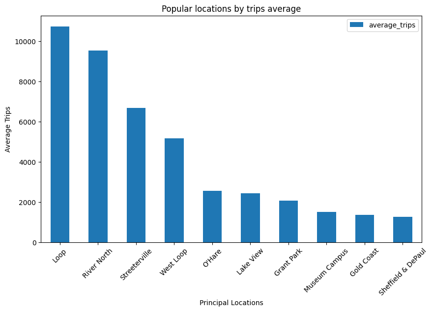
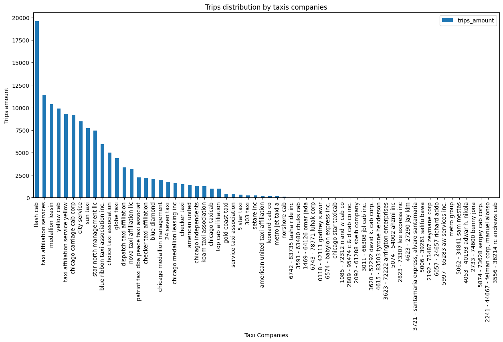

<p align="center"><b>Interpretacion y analisis del comportamiento de los viajes en taxi en chicago: destinos más concurridos, empresas destacadas y efecto de las condiciones climáticas</b></p>


El proyecto tiene como propósito examinar el comportamiento de los viajes en taxi en la ciudad de Chicago, tomando como base tres aspectos principales:

- Barrios
- Destinos mas populares o concurridos
- La relacion entre la duracion del viaje y las condiciones externas (meteorologicas)


Estas son las librerias usadas en el proyecto:

```python
import pandas as pd
import matplotlib.pyplot as plt
import seaborn as sns
import numpy as np
from scipy import stats as st
```


Para el analisis se utilizaron 3 datasets con toda informacion necesaria:

- sql_1: Contiene los nombres de las compañías y la cantidad de viajes realizados por cada una entre el 15 y 16 de noviembre de 2017 [(Click aqui)](project_sql_result_01.csv)

- sql_4: Muestra los barrios de Chicago donde finalizaron los viajes y el promedio de trayectos que terminaron en cada zona durante noviembre de 2017 [Click aqui](project_sql_result_04.csv)

- sql_7: Incluye información sobre viajes desde el Loop hasta el Aeropuerto Internacional O’Hare de Chicago, como la fecha de inicio, las condiciones climáticas y la duración del trayecto. Para obtener los datos se utilizaron Requests, Beautiful Soup y Pandas, mientras que SQL se empleó para integrar toda la información en un solo dataframe [Click aqui](project_sql_result_07.csv)


Aqui, utilice las librerias requests, BeatifulSoup y pandas para poder extraer y crear un dataset llamado weather records apartir de la informacion del clima para chicago en 2017:

```python
import requests
from bs4 import BeautifulSoup
import pandas as pd
URL='https://practicum-content.s3.us-west-1.amazonaws.com/data-analyst-eng/moved_chicago_weather_2017.html'
req = requests.get(URL)
soup = BeautifulSoup(req.text, 'lxml')
table = soup.find('table', attrs={"id": "weather_records"})
heading_table=[]
for row in table.find_all('th'):
    heading_table.append(row.text)   
content=[]
for row in table.find_all('tr'):
    if not row.find_all('th'):
        content.append([element.text for element in row.find_all('td')])
weather_records = pd.DataFrame(content, columns = heading_table)
print(weather_records)
```

Además, utilicé SQL para unir el dataframe de “trip” con el llamado “weather_records”. Posteriormente, generé una columna que clasifica el clima como “Bueno” o “Malo”, basándome en ciertas condiciones específicas:

```SQL
SELECT 
    trips.start_ts,
    CASE 
        WHEN description LIKE '%rain%' or description LIKE '%storm%' THEN 
    'Bad'
    ELSE 'Good'
END AS weather_conditions,
    trips.duration_seconds
FROM 
    weather_records
    INNER JOIN trips ON trips.start_ts = weather_records.ts
WHERE 
    pickup_location_id = 50 
    AND dropoff_location_id = 63 
    AND EXTRACT(DOW FROM trips.start_ts) = 6
```


<b>Tras el análisis, algunos aspectos destacados son:</b>


1. Loop es el barrio principal por ser el destino final de viajes por taxi de la mayoria de gente, mas que cualquier otro barrio, Loop domina completamente. Se debate un poco con River North y no por mucho, tambien se puede decir que es otro barrio que domina en cuanto destinos. Es curioso ver como la concentracion geografica se basa en los primeros cuatro, y digo 4 porque a partir de West Loop, tiene una caida muy pronunciada empezando por el aeropuerto "O'Hare" lo que hace sentido, el aeropuerto representa un patron diferente de demanda, por lo que infiero a que las zonas centrales comerciales estan dentro de estos 4 principales barrios y es por eso que hay mas cantidad de viaje hacia estos destinos. En cuanto a como se debate la cantidad de destinos entre los dos principales barrios, podria inferir a que es por preferencias en cuanto a si es turistico uno a diferencia del otro, o si tienen implementaciones de infraestructura de comercios.




2. Hay 64 compañias de taxis referentes a la cantidad de viajes que hizo cada una, pero en el grafico se percibe la excepcion sobre ciertas empresas que no tuvieran ningun viaje. Practicamente poco mas de la mitad de registros de empresas de taxis quedan obsoletas en cuanto la consideracion de usar su servicio. Particularmente se caracterizan por ser empresas no reconocidas ya que principalmente se dan a conocer por el numero de la empresa y no por su nombre. Esencialmente eso podria definir la diferencia entre una compañia con experiencia, la cual se da a conocer por el nombre en si y no por el telefono, o minimo eso es lo que practicamente dice el grafico, justo porque todas las compañias que tienen solo el nombre y sin telefono, son las que si tuvieron viajes y las que tienen telefono y el nombre de su compañia no tuvieron ningun viaje. Parece ser que las empresas que tienen su numero de telefono junto con el nombre de su empresa, no tienen ningun tipo de experiencia, ya que son nuevas o todavia no tienen los recursos suficientes como para venderles sus servicios a los clientes.


